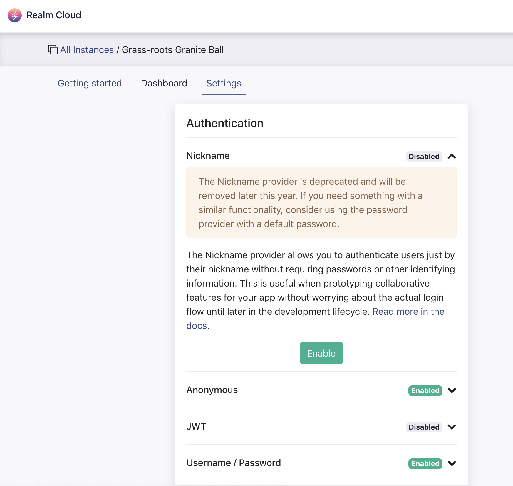
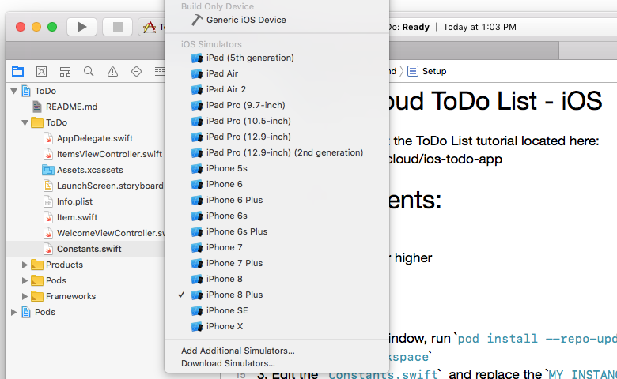

# Realm Cloud ToDo List - iOS

This is a complement to the Realm Cloud _ToDo List_ tutorial https://docs.realm.io/cloud/ios-todo-app

## Requirements:

1. [XCode 9.2](https://itunes.apple.com/us/app/xcode/id497799835?mt=12)
2. [Cocoapods](https://guides.cocoapods.org/using/getting-started.html) 1.2.x or higher

## Setup

1. **Important:** This project uses the [nickname authentication provider](https://docs.realm.io/server/configure/authentication/nickname-authentication), which you must opt-in to use. To opt in,
   - Log in to https://cloud.realm.io.
   - Select your instance.
   - Go to the "Settings" tab.
   - Under "Authentication", click to expand "Nickname".
   - Click "Enable" and accept the prompt.

If you forget to enable nickname authentication and run the app anyway, you will see the following fatal error: "Your request parameters did not validate. provider: Invalid parameter 'provider'!".

2. In a new terminal window, run `pod install --repo-update` to update and install the required Realm SDK.
3. Open `ToDo.xcworkspace` with Xcode.
4. Locate the `Constants.swift` file in the file navigator; Edit it and replace `MY_INSTANCE_ADDRESS` with your Cloud Instance Address.
5. Select a simulator from the Xcode tool bar (see figure 1).
6. Run the project by pressing the run button on the tool bar.

